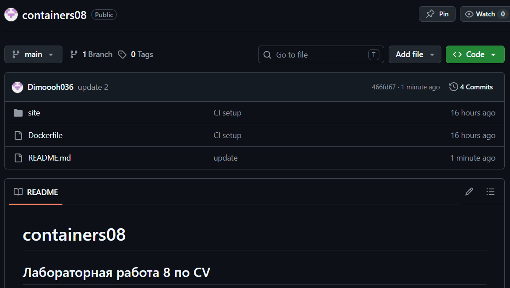

# containers08

## Лабораторная работа 8 по CV

## Цель работы.

В рамках данной работы студенты научатся настраивать непрерывную интеграцию с помощью Github Actions.

## Задание.

Создать Web приложение, написать тесты для него и настроить непрерывную интеграцию с помощью Github Actions на базе контейнеров.

## Описание выполнения работы с ответами на вопросы.

Создал репозиторий containers08 скопировав его себе на компьютер.

В директории containers08 создал директорию ```./site```.
В директории ```./site``` будет располагаться Web приложение на базе PHP.

    Создание Web приложения
Создал в директории ```./site Web``` приложение на базе PHP со следующей структурой:

```
site
├── modules/
│   ├── database.php
│   └── page.php
├── templates/
│   └── index.tpl
├── styles/
│   └── style.css
├── config.php
└── index.php
```

Файл ```modules/database.php``` содержит класс Database для работы с базой данных:

```
<?php

class Database {
    private $pdo;

    public function __construct($path) {
        $this->pdo = new PDO("sqlite:" . $path);
    }

    public function Execute($sql) {
        return $this->pdo->exec($sql);
    }

    public function Fetch($sql) {
        $stmt = $this->pdo->query($sql);
        return $stmt->fetchAll(PDO::FETCH_ASSOC);
    }

    public function Create($table, $data) {
        $keys = implode(',', array_keys($data));
        $values = implode(',', array_map(fn($v) => "'$v'", array_values($data)));

        $this->Execute("INSERT INTO $table ($keys) VALUES ($values)");
        return $this->pdo->lastInsertId();
    }

    public function Read($table, $id) {
        $result = $this->Fetch("SELECT * FROM $table WHERE id = $id");
        return $result[0] ?? null;
    }

    public function Update($table, $id, $data) {
        $set = [];
        foreach ($data as $key => $value) {
            $set[] = "$key='$value'";
        }
        $set = implode(',', $set);

        return $this->Execute("UPDATE $table SET $set WHERE id = $id");
    }

    public function Delete($table, $id) {
        return $this->Execute("DELETE FROM $table WHERE id = $id");
    }

    public function Count($table) {
        $result = $this->Fetch("SELECT COUNT(*) as count FROM $table");
        return $result[0]['count'];
    }
}
```

Файл ```modules/page.php``` содержит класс Page для работы с страницами. Класс должен содержать методы:

```
<?php

class Page {
    private $template;

    public function __construct($template) {
        $this->template = file_get_contents($template);
    }

    public function Render($data) {
        $output = $this->template;
        foreach ($data as $key => $value) {
            $output = str_replace("{{{$key}}}", $value, $output);
        }
        return $output;
    }
}
```

Файл ```templates/index.tpl``` содержит шаблон страницы.

```
<html>
<head>
    <link rel="stylesheet" href="styles/style.css">
</head>
<body>
    <h1>{{title}}</h1>
    <p>{{content}}</p>
</body>
</html>
```

Файл ```styles/style.css``` содержит стили для страницы.

```
body {
    font-family: Arial;
}
```

Файл ```index.php``` содержит код для отображения страницы:

```
<?php

require_once __DIR__ . '/modules/database.php';
require_once __DIR__ . '/modules/page.php';
require_once __DIR__ . '/config.php';

$db = new Database($config["db"]["path"]);
$page = new Page(__DIR__ . '/templates/index.tpl');

$pageId = $_GET['page'] ?? 1;

$data = $db->Read("page", $pageId);

echo $page->Render($data);
```

Файл ```config.php``` содержит настройки для подключения к базе данных.

```
<?php

$config = [
    "db" => [
        "path" => "/var/www/db/db.sqlite"
    ]
];
```

    Подготовка SQL файла для базы данных
Создал в корневом каталоге директорию ```./sql```.
В созданной директории создал файл ```schema.sql``` со следующим содержимым:

```
CREATE TABLE page (
    id INTEGER PRIMARY KEY AUTOINCREMENT,
    title TEXT,
    content TEXT
);

INSERT INTO page (title, content) VALUES ('Page 1', 'Content 1');
INSERT INTO page (title, content) VALUES ('Page 2', 'Content 2');
INSERT INTO page (title, content) VALUES ('Page 3', 'Content 3');
```

    Создание тестов
Создал в корневом каталоге директорию ```./tests```.
В созданном каталоге создал файл ```testFramework.php``` со следующим содержимым и подкоректировал его:

```
<?php

require_once __DIR__ . '/testframework.php';
require_once __DIR__ . '/../config.php';
require_once __DIR__ . '/../modules/database.php';
require_once __DIR__ . '/../modules/page.php';

$testFramework = new TestFramework();

function testDbConnection() {
    global $config;
    $db = new Database($config["db"]["path"]);
    return assertExpression($db != null, "DB connected", "DB failed");
}

function testDbCount() {
    global $config;
    $db = new Database($config["db"]["path"]);
    return assertExpression($db->Count("page") >= 3);
}

function testDbCreate() {
    global $config;
    $db = new Database($config["db"]["path"]);

    $id = $db->Create("page", [
        "title" => "Test",
        "content" => "Test content"
    ]);

    return assertExpression($id > 0);
}

function testDbRead() {
    global $config;
    $db = new Database($config["db"]["path"]);

    $data = $db->Read("page", 1);
    return assertExpression($data['title'] === 'Page 1');
}

function testDbUpdate() {
    global $config;
    $db = new Database($config["db"]["path"]);

    $db->Update("page", 1, ["title" => "Updated"]);
    $data = $db->Read("page", 1);

    return assertExpression($data['title'] === 'Updated');
}

function testDbDelete() {
    global $config;
    $db = new Database($config["db"]["path"]);

    $id = $db->Create("page", ["title"=>"Del","content"=>"Del"]);
    $db->Delete("page", $id);

    $data = $db->Read("page", $id);
    return assertExpression($data === null);
}

function testPageRender() {
    $page = new Page(__DIR__ . '/../templates/index.tpl');

    $html = $page->Render([
        "title" => "Hello",
        "content" => "World"
    ]);

    return assertExpression(strpos($html, "Hello") !== false);
}

// добавление тестов
$testFramework->add('DB connection', 'testDbConnection');
$testFramework->add('DB count', 'testDbCount');
$testFramework->add('DB create', 'testDbCreate');
$testFramework->add('DB read', 'testDbRead');
$testFramework->add('DB update', 'testDbUpdate');
$testFramework->add('DB delete', 'testDbDelete');
$testFramework->add('Page render', 'testPageRender');

// запуск
$testFramework->run();
echo $testFramework->getResult();
```

    Создание Dockerfile
Создал в корневом каталоге файл ```Dockerfile``` со следующим содержимым:

```
FROM php:7.4-fpm as base

RUN apt-get update && \
    apt-get install -y sqlite3 libsqlite3-dev && \
    docker-php-ext-install pdo_sqlite

VOLUME ["/var/www/db"]

COPY sql/schema.sql /var/www/db/schema.sql

RUN echo "prepare database" && \
    cat /var/www/db/schema.sql | sqlite3 /var/www/db/db.sqlite && \
    chmod 777 /var/www/db/db.sqlite && \
    rm -rf /var/www/db/schema.sql && \
    echo "database is ready"

COPY site /var/www/html
```

    Настройка Github Actions
Создал в корневом каталоге репозитория файл ```.github/workflows/main.yml``` со следующим содержимым:

```
name: CI

on:
  push:
    branches:
      - main

jobs:
  build:
    runs-on: ubuntu-latest
    steps:
      - name: Checkout
        uses: actions/checkout@v4
      - name: Build the Docker image
        run: docker build -t containers08 .
      - name: Create `container`
        run: docker create --name container --volume database:/var/www/db containers08
      - name: Copy tests to the container
        run: docker cp ./tests container:/var/www/html
      - name: Up the container
        run: docker start container
      - name: Run tests
        run: docker exec container php /var/www/html/tests/tests.php
      - name: Stop the container
        run: docker stop container
      - name: Remove the container
        run: docker rm container
```

    Запуск и Тестирование:

  git add .
  git commit -m "CI setup"
  git push

  

### Ответы на вопросы:

1. Что такое непрерывная интеграция?

Непрерывная интеграция (CI) — это практика, при которой код автоматически собирается и тестируется

2. Для чего нужны юнит-тесты? Как часто их нужно запускать?

Юнит-тесты проверяют отдельные части кода (функции, методы, классы) и дают гарантию, что изменения не ломают существующую логику.

3. Что нужно изменить в файле .github/workflows/main.yml для того, чтобы тесты запускались при каждом создании запроса на слияние (Pull Request)?

Не нужно, ничего менять, нужно добавить событие ```pull_request```

4. Что нужно добавить в файл .github/workflows/main.yml для того, чтобы удалять созданные образы после выполнения тестов?

  name: Remove image
  run: docker rmi containers08

## Выводы.

В рамках данной работы я научился настраивать непрерывную интеграцию с помощью Github Actions.
